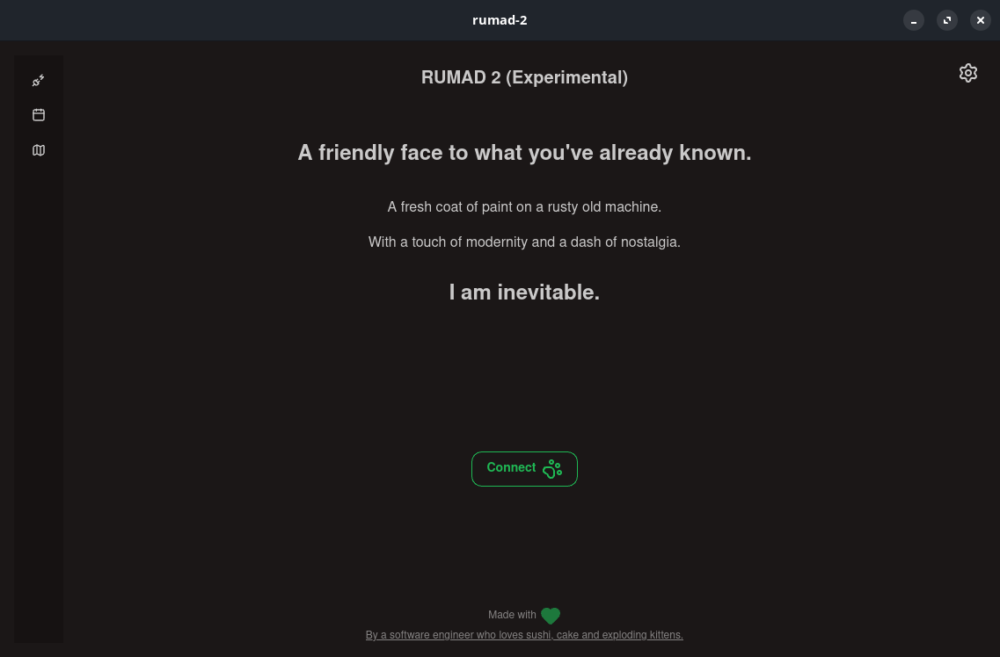

# RUMAD + 2
RUMAD is the core of the Mayaguez Engineering University's digital infrastructure. [Developed in early 1990-2000s](https://www.uprm.edu/wdt/rea/), the backbones of the system are showing their prehistoric age today. Especially when it comes to the stressful process of selecting classes for the next semester.

`RUMAD + 2` is simply just a scraper for the TUI that is `ssh estudiante@rumad.uprm.edu`. That would imply that failures in the digital infrastructure would still exist today. Additionally, the data `RUMAD + 2` can display is limited by the backend's results. However, we can work around the pitfalls of an ancient and confusing terminal experience by providing a library (`librumad2`) and a better navigating experience `RUMAD + 2`.

The features `RUMAD + 2` offers (but not limited to in the future):
- iOS & Android support
- Friendlier experience
- Calendar preview
- Campus map for classes
- A splash screen for fun!

Both `RUMAD + 2` and `librumad2` are open source and free to use. Keep in mind there's a license attached to `RUMAD + 2` and `librumad2` each if you intend on using the code for your projects.

## Disclaimer

`RUMAD + 2` is not affiliated with, endorsed by, or sponsored by the University of Puerto Rico at Mayagüez (UPRM). "RUMAD", "UPRM", and the university's other names, logos, and marks are the property of UPRM and are referenced here only to describe the system this project connects to. See the in-app Terms of Service (Settings) for the full text.

# Contributing
Contributions are welcome! The project uses the `Tauri` desktop framework with SolidJS for the frontend and Rust in the backend.

spoiler

though I may choose to switch to Flutter for the mobile (and maybe desktop) side in the future.

I used AI for the most daunting tasks, specifically scraping, which is why you'll find a verbose Claude.md file in the repository. 

- Is this project fully vibecoded? No. 
- Will fully AI developed solutions be accepted? No.

## Recommended IDE Setup

- [VS Code](https://code.visualstudio.com/) + [Tauri](https://marketplace.visualstudio.com/items?itemName=tauri-apps.tauri-vscode) + [rust-analyzer](https://marketplace.visualstudio.com/items?itemName=rust-lang.rust-analyzer)
